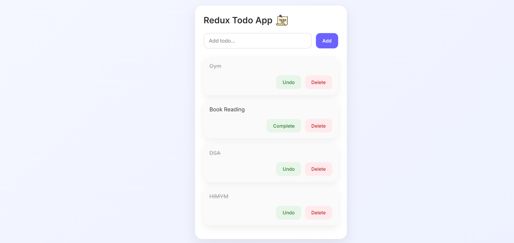

# 📝 Redux Todo App

A clean and modern **Todo application** built using **React + Redux Toolkit**, featuring **localStorage persistence** and a **premium UI layout**.

---

## 🚀 Live Preview



> Screenshot of the application UI

---

## ✨ Features

- ➕ Add new todos  
- ✅ Mark todos as complete / undo  
- 🗑️ Delete todos  
- 💾 Persistent data using **localStorage**  
- 🎨 Clean, modern, card-based UI  
- 📱 Responsive and minimal design  

---

## 🛠️ Skills & Technologies Used

<p align="left">
  
  
  
  
  
</p>

---

## 🧠 Application Workflow

1. User enters a task in the input field  
2. Clicking **Add** dispatches a Redux action  
3. Todo is stored in Redux global state  
4. State is synced to **localStorage**  
5. Todos persist even after page refresh  
6. User can mark tasks as complete or undo  
7. User can delete tasks permanently  

---

## 📂 Project Structure

```
src/
 ├── components/
 │   ├── TodoInput.jsx
 │   ├── TodoItem.jsx
 │   └── TodoList.jsx
 ├── features/
 │   └── todos/
 │       └── todoSlice.js
 ├── redux/
 │   └── store.js
 ├── App.jsx
 ├── main.jsx
 └── index.css
public/
 └── app.png
```

---

## ▶️ Getting Started

```bash
git clone <your-repo-url>
cd redux-todo-app
npm install
npm run dev
```

---

## 📌 Key Learnings

- Redux Toolkit slice-based state management  
- Action dispatching & reducer logic  
- LocalStorage persistence  
- Clean UI/UX practices  
- Component-based React architecture  

---

## 🤝 Contributing

Feel free to fork this repository, improve the UI, or add new features.

---

## 👤 Author

**Krishna**

Built with ❤️ using React & Redux Toolkit
